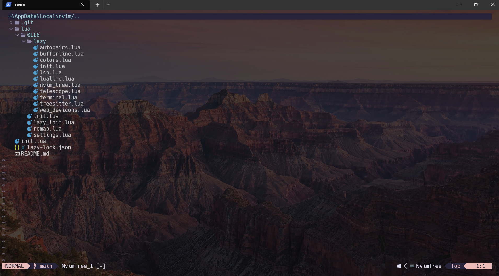
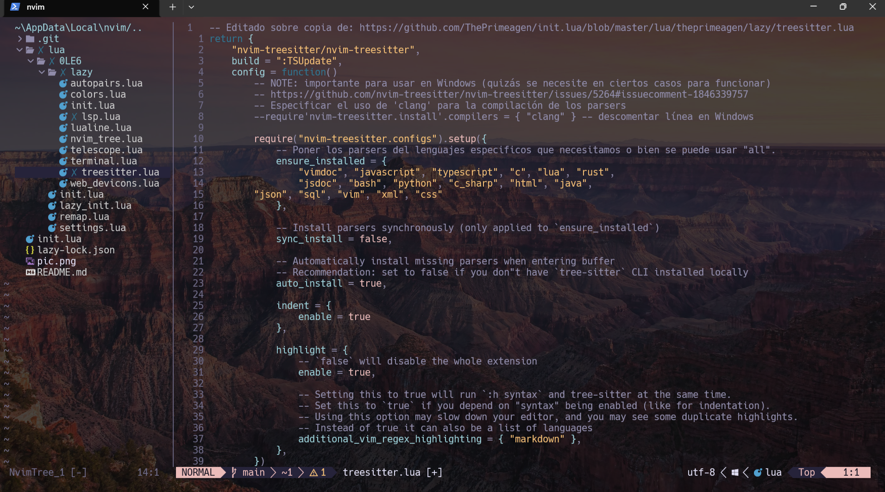
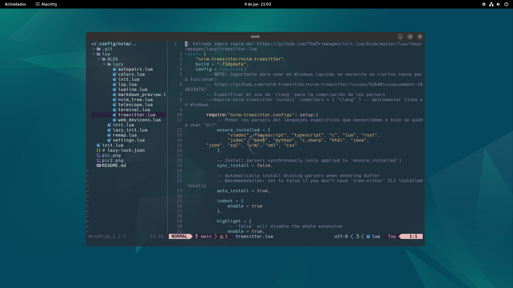

# Config Windows
Para que funcione en Windows se ha de hacer lo siguiete:

Instalar __scoop__ como gestor de instalaciónd de paquetes desde este link https://scoop.sh/, copia el script de powershell que hay para su instalación y listo.

Tener instalado LLVM y GCC, emplear el gestor de paquetes scoop (no hace halta luego añadir al PATH, se hace automatico con Scoop)
````powershell
scoop install llvm

scoop install gcc
````

También hac falta la última versión de nodejs, instalamos con scoop también:

````powrshell
scoop install node
``````

Y por ultimo las herramientas de fd y ripgrep para temas de busquedas dentro de archivos:

`````powershell
scoop install ripgrep

scoop install fd
`````

__NOTE:__ quizás se me escape algún detalle más, lo añadiriá aquí como update.

# Config Linux o en su defecto WSL



Para que todo sea más sencillo y rapido, usar Homebrew como manejador de paquetes.

https://brew.sh/

```bash
/bin/bash -c "$(curl -fsSL https://raw.githubusercontent.com/Homebrew/install/HEAD/install.sh)"
```

Cuando lo tengamos, lo emplearemos para instalar Node, gcc, ripgrep...
Copiar, pegar y enter para que se ejecute el script de bash de instalación de herramientas que necesitaremos:

```bash
# Primero hacemos ejecutable nuestro script run_setup.sh
chmod +x run_setup.sh
./run_setup.sh
```

